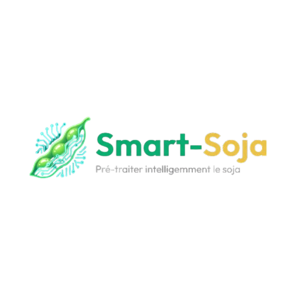
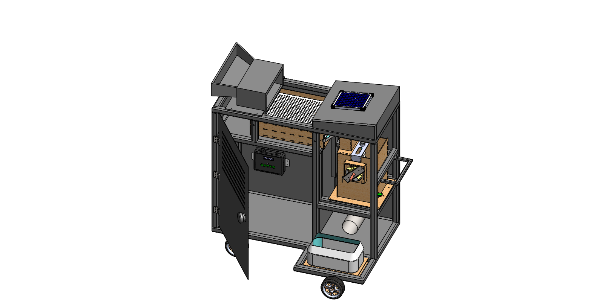

<div align="center">



# 🌱 SMART-SOJA

### An Autonomous IoT-Based Mobile Soybean Pre-processing System

[](LICENSE)


[](https://github.com/virgile-tchidehou/smart-soja)
[](https://github.com/virgile-tchidehou/smart-soja/commits/main)


**[Documentation](#-documentation) · [Architecture](#️-system-architecture) · [Hardware](#️-hardware-overview) · [Roadmap](#-project-roadmap)**

</div>

---

SMART-SOJA is an academic engineering project co-developed by **Elisa Christelle LOKO** and **Dodji Virgile TCHIDEHOU**. It explores a mobile and connected soybean pre-processing unit designed to improve post-harvest handling in rural environments.

The prototype combines embedded systems, industrial automation, IoT technologies and an off-grid solar/battery architecture. At its current stage, the project is a **functional proof of concept**: the main sensing, actuation, drying and IoT subsystems have been validated individually or in partial integration, while full-cycle validation under a real 2–5 kg load and final HX711 weighing integration remain future work.

<div align="center">

</div>

---

## 📖 Table of Contents

- Overview
- The Problem
- Objectives
- Key Features
- System Architecture
- Hardware Overview
- Software Architecture
- Technology Stack
- Repository Structure
- Documentation
- Roadmap
- Future Improvements
- Project Team
- License

---

# 📌 Overview

Soybean production is rapidly increasing across Africa, particularly in Benin. However, post-harvest losses caused by inadequate cleaning, excessive moisture and poor traceability continue to reduce product quality and market value.

SMART-SOJA addresses these challenges by providing a mobile cyber-physical system capable of:

- Cleaning soybean grains through a vibrating sieve mechanism
- Measuring grain moisture at two points
- Controlling an active drying subsystem
- Supporting final batch weighing through an HX711-based subsystem *(final integration pending)*
- Recording production data locally
- Synchronizing traceability data through MQTT

The project integrates mechanical engineering, embedded electronics, industrial automation and cloud connectivity into a single modular platform.

---

# ❗ The Problem

Smallholder farmers often face several challenges:

- High post-harvest losses
- Non-uniform drying
- Manual quality control
- Lack of digital traceability
- Limited access to electricity

SMART-SOJA was designed to provide an affordable and intelligent solution adapted to rural environments.

---

# 🎯 Objectives

The project aims to:

- automate soybean pre-processing;
- improve grain quality before storage;
- reduce moisture-related losses;
- provide digital traceability;
- support off-grid operation through a solar/battery power architecture;
- support smart agriculture initiatives.

---

# ✨ Key Features

- 🌱 Mobile modular platform
- 📡 IoT connectivity using MQTT
- ⚙️ Embedded control with ESP32
- ☀️ Solar/battery off-grid power architecture
- 💧 Dual moisture sensing
- 🔥 Active drying control
- ⚖️ HX711-based weighing subsystem *(final integration pending)*
- 💾 Offline data logging (MicroSD)
- ☁️ Cloud synchronization
- 📊 Real-time monitoring
- 🧠 FreeRTOS multitasking architecture
- 🔄 GRAFCET-based sequential control

---

# 🏗️ System Architecture

SMART-SOJA is composed of six major subsystems:

## Mechanical System

- Modular chassis
- Cleaning mechanism
- Drying chamber
- Weighing module
- Mobile structure

## Embedded Electronics

- ESP32 microcontroller
- Sensors
- Power electronics
- Human-Machine Interface

## Energy System

- Solar panel
- Battery
- Charging controller
- DC converters

## Control System

- FreeRTOS scheduler
- GRAFCET automation
- Safety management

## IoT Layer

- MQTT communication
- JSON data exchange
- Cloud synchronization
- Store-and-Forward mechanism

## Traceability Layer

- Batch identification
- Local storage
- Cloud database
- Digital production records

---

# ⚙️ Hardware Overview

Main components include:

- ESP32 DevKit
- Capacitive moisture sensors
- HX711 load cell module
- Servo motors
- DC geared motors
- MOSFET power drivers
- LCD I2C display
- MicroSD module
- Solar panel
- Battery system

---

# 💻 Software Architecture

The embedded firmware is based on FreeRTOS.

Main software modules:

- Safety Task
- Control Task
- Sensor Task
- Actuator Task
- LCD Task
- MQTT Task

The control logic is modeled using a two-level GRAFCET to ensure deterministic and reliable operation.

---

# 🛠️ Technology Stack

## Embedded

- ESP32
- FreeRTOS
- Arduino IDE / Arduino Framework

## IoT

- MQTT (HiveMQ broker)
- JSON
- Wi-Fi

## Cloud & Web

- Node.js / Express (MQTT-to-cloud bridge API)
- Firebase (Firestore, Realtime Database, Hosting)
- Vite.js / Vanilla JavaScript (dashboard SPA)

## Mechanical

- SolidWorks

## Electronics

- KiCad

---

# 📁 Repository Structure

```text
smart-soja/
│
├── README.md                  # Présentation du projet
├── LICENSE
├── .gitignore
│
├── docs/                       # Documentation technique (9 chapitres + images)
│   ├── 01-project-overview.md
│   ├── 02-system-architecture.md
│   ├── 03-hardware-design.md
│   ├── 04-mechanical-design.md
│   ├── 05-software-architecture.md
│   ├── 06-energy-system.md
│   ├── 07-testing-validation.md
│   ├── 08-results.md
│   ├── 09-future-improvements.md
│   └── images/
│
├── firmware/
│   └── esp32/
│       └── src/                # Firmware ESP32 (FreeRTOS, GRAFCET)
│
├── hardware/                   # Conception électronique (KiCad)
│   ├── conception.md
│   ├── pcb/circuit_smart-soja/ # Projet KiCad complet (sch, pcb, gerbers, BOM)
│   ├── schematics/              # Exports PDF/SVG du schéma
│   ├── bom/                     # Nomenclature des composants
│   ├── wiring/                  # Schémas de brochage (pinout) des capteurs/modules
│   └── datasheets/               # Références vers les fiches techniques constructeur
│
├── mechanical/                 # Conception mécanique (SolidWorks)
│   ├── conception.md
│   ├── solidworks/
│   ├── stl/
│   ├── drawings/
│   └── renders/
│
├── cloud/
│   ├── mqtt/                   # Spécification du protocole ESP32 ↔ broker
│   ├── database/                # Documentation du schéma Firestore
│   ├── api/                     # Backend Node.js/Express (passerelle MQTT → Firebase)
│   └── dashboard/app/           # Plateforme web Vite.js (tableaux de bord)
│
├── media/                      # Photos du prototype, captures d'écran, diagrammes
│   ├── prototype/
│   ├── screenshots/
│   └── diagrams/
│
├── research/
│   └── thesis/                  # Mémoire complet (source de la documentation)
│
└── .github/
    └── ISSUE_TEMPLATE/
```

---

# 📚 Documentation

Full technical documentation lives in [`docs/`](docs/):

| Chapter | Content |
|---|---|
| [01 – Project Overview](docs/01-project-overview.md) | Context, problem statement, objectives |
| [02 – System Architecture](docs/02-system-architecture.md) | Edge / Cloud / Application layers |
| [03 – Hardware Design](docs/03-hardware-design.md) | ESP32, sensors, actuators, PCB |
| [04 – Mechanical Design](docs/04-mechanical-design.md) | Modular chassis and 4 functional blocks |
| [05 – Software Architecture](docs/05-software-architecture.md) | FreeRTOS, GRAFCET, MQTT/JSON, web dashboard |
| [06 – Energy System](docs/06-energy-system.md) | Solar/battery sizing |
| [07 – Testing & Validation](docs/07-testing-validation.md) | Unit test protocol and results |
| [08 – Results](docs/08-results.md) | Prototype outcomes, financial evaluation |
| [09 – Future Improvements](docs/09-future-improvements.md) | Validation roadmap and product evolution |

The full academic thesis (mémoire) this documentation is derived from is archived in [`research/thesis/`](research/thesis/).

---

# 🚀 Project Roadmap

- [x] Problem identification
- [x] Requirements analysis
- [x] Mechanical design
- [x] Electronic architecture
- [x] Embedded software
- [x] Prototype assembly and integration
- [x] Unit-level functional validation (sensors, actuators, MQTT traceability)

### Next Milestones

- [ ] Full clean + dry cycle validation under real load (2–5 kg)
- [ ] Load-cell (HX711) weighing module integration
- [ ] Field testing under real environmental conditions
- [ ] PCB redesign (multilayer)
- [ ] Mobile application
- [ ] OTA firmware updates
- [ ] AI-assisted moisture prediction
- [ ] Version 2 prototype

---

# 🌍 Future Vision

SMART-SOJA is envisioned as a scalable smart agriculture platform capable of supporting digital transformation in African agricultural value chains.

Future versions will integrate:

- Edge AI
- Predictive maintenance
- Computer vision
- Fleet management
- Remote diagnostics
- Industrial IoT deployment

---

<div align="center">

# 👥 Project Team

**Elisa Christelle LOKO** — Co-developer  
**Dodji Virgile TCHIDEHOU** — Co-developer · repository maintainer

Final-year project — Professional License in Industrial Computing & Maintenance, EGEI / UCAO-UUC, 2026.  
Academic supervisor: **Dr DIDAVI Audace**

This public repository is maintained by Dodji Virgile TCHIDEHOU and documents the team project together with the technical work contributed during its development.

[](https://github.com/virgile-tchidehou)

</div>

---

# 📄 License

<div align="center">

This project is licensed under the [MIT License](LICENSE).

**🌱 SMART-SOJA — from the field to the factory, one certified batch at a time.**

</div>
