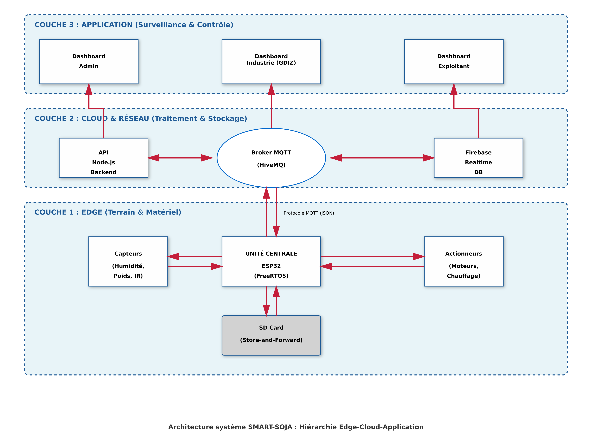
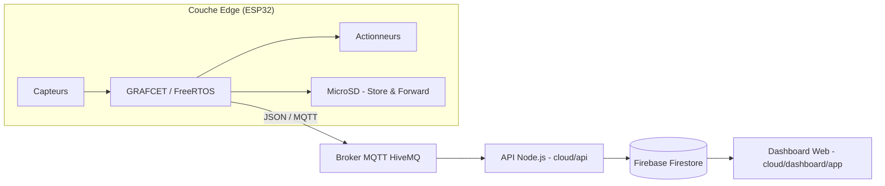

# System Architecture

SMART-SOJA repose sur une architecture modulaire hiérarchisée en **trois couches fonctionnelles**, garantissant un fonctionnement autonome complet en mode déconnecté tout en s'intégrant nativement dans une infrastructure Cloud de type Industrie 4.0.

## Couche Edge (terrain)

L'**ESP32** gère en temps réel :
- l'acquisition des capteurs (humidité, température, présence, poids) ;
- le pilotage des actionneurs (moteurs, résistance, ventilateur, servomoteurs) ;
- la logique de contrôle séquentiel **GRAFCET** ;
- la sécurité prioritaire (arrêt d'urgence, surchauffe).

Détails : [05-software-architecture.md](05-software-architecture.md).

## Couche Cloud

- **Broker MQTT (HiveMQ)** : réception des trames télémétrie et fin-de-lot publiées par l'ESP32.
- **API Node.js (`cloud/api/`)** : passerelle qui intercepte les messages MQTT, les valide, les enregistre dans Firebase et génère les documents de traçabilité (QR Code, PDF).
- **Firebase (Firestore + Realtime Database)** : stockage persistant des lots traités.

## Couche Application

- **Tableau de bord web (`cloud/dashboard/app/`)** : Single Page Application (Vite.js + JavaScript) avec trois profils d'accès :
  - **Exploitant** : suivi de production temps réel, contrôle manuel des actionneurs via MQTT, alertes maintenance ;
  - **Industrie (GDIZ Ready)** : validation qualité des lots entrants, graphiques humidité/température, certificats de traçabilité PDF ;
  - **Admin** : gestion de la flotte de machines et des utilisateurs.

## Résilience réseau : Store-and-Forward

En l'absence de couverture WiFi (fréquente en zone rurale), toutes les métriques sont sauvegardées localement sur carte MicroSD (SPI, FAT32) et retransmises automatiquement au broker MQTT dès la reconnexion. Ce mécanisme garantit qu'aucune donnée de traçabilité n'est perdue.

## Flux de données

## Voir aussi

- [03-hardware-design.md](03-hardware-design.md)
- [04-mechanical-design.md](04-mechanical-design.md)
- [../cloud/mqtt/ESP32_PROTOCOL.md](../cloud/mqtt/ESP32_PROTOCOL.md) — spécification détaillée des topics et payloads MQTT
