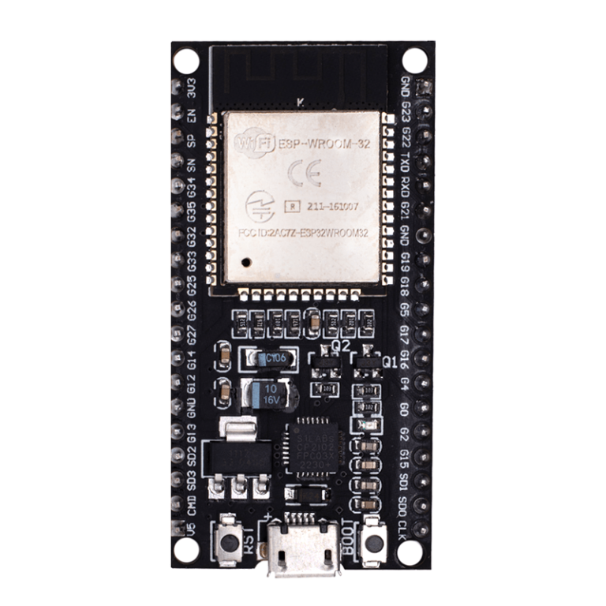

# Hardware Design

Fichiers sources : [`hardware/pcb/circuit_smart-soja/`](../hardware/pcb/circuit_smart-soja/) (projet KiCad complet), [`hardware/bom/`](../hardware/bom/), [`hardware/schematics/`](../hardware/schematics/). Document de conception détaillé : [`hardware/conception.md`](../hardware/conception.md).

## Unité de traitement : ESP32-WROOM-32

| Caractéristique | Spécification |
|---|---|
| Microcontrôleur | Tensilica LX6 double cœur, 240 MHz |
| Alimentation | 5 V DC (microUSB) / 3,3 V DC (E/S) |
| Consommation veille | 5 µA |
| Mémoire | 520 Ko SRAM / 4 Mo Flash |
| Connectivité | Wi-Fi 802.11 b/g/n + Bluetooth 4.2 |
| GPIO | 30 broches (3× UART, 2× I2C, 3× SPI, 12× ADC, 2× DAC) |

**Justification :** l'architecture dual-core dédie un cœur au contrôle-commande temps réel (capteurs, PWM) et l'autre à la communication IoT (MQTT/WiFi), garantissant un déterminisme critique. Le brochage évite les *strapping pins* (GPIO 0, 2, 12, 15) critiques au démarrage.

## Chaîne d'acquisition (capteurs)

| Capteur | Plage / Précision | Rôle | Limites |
|---|---|---|---|
| DHT22 | 0–100 % HR / ±2 % | Humidité/température ambiante | Temps de réponse 2 s |
| Sonde capacitive (×2, Soil1/Soil2) | 0–100 % / ±5 % | Humidité des grains | Dérive thermique |
| IR réflectif (×2) | 2–30 cm / binaire | Présence trémie/sac | Sensible à la lumière ambiante |
| Cellule de charge + HX711 | 0–10 kg / ±0,1 % | Pesée finale du lot | Sensible aux vibrations |

La sonde capacitive mesure la constante diélectrique du milieu (eau ≈ 80 vs grain sec ≈ 3–5), ce qui la rend insensible à la corrosion. Deux sondes (haut/bas de la zone de séchage) permettent une double validation : le séchage ne s'arrête que si **Soil1 ET Soil2 ≤ 12 %**.

**Calibration in-situ** (ADC 12 bits, 0–4095) : point sec (H ≈ 8 %, soja étuvé) comme borne haute, point humide (H ≈ 20 %) comme borne basse, puis interpolation linéaire. Écart maximal observé face à un hygromètre de référence (Testo 608-H2) : ±5 %.

## Chaîne d'action (actionneurs)

| Actionneur | Puissance / Courant | Rôle |
|---|---|---|
| Moteurs JGA25-370 (×2) | 3 W / 0,5 A (max 1,2 A) | Tamisage, vis sans fin |
| Servo SG90 (×2) | 1,5 W / 0,1–0,5 A | Vanne trémie |
| Résistance chauffante (×2) | 12 W / 1 A | Séchage |
| Ventilateur DC (×2) | 1,8 W / 0,15 A | Circulation d'air |
| MOSFET IRLZ44N (×4) | *Logic level*, 47 A max, RDSon 0,022 Ω | Commutation 12 V depuis GPIO 3,3 V |

Le MOSFET **IRLZ44N** est retenu car il se sature directement avec les 3,3 V de l'ESP32 (contrairement aux MOSFET standards qui exigent 10 V de grille).

## Interfaces homme-machine et traçabilité locale

| Périphérique | Protocole | Rôle |
|---|---|---|
| LCD 16×2 | I2C | Affichage temps réel |
| Lecteur MicroSD | SPI | Store-and-Forward |
| Potentiomètres ×2 | ADC 12 bits | Réglage vitesse moteurs |
| Boutons ON/OFF | GPIO pull-up | Démarrage/arrêt sécurisé |
| LEDs + buzzer | Digital/PWM | Signalisation d'état |

## Circuit imprimé (PCB)

Le circuit est segmenté en cinq zones fonctionnelles pour limiter les interférences électromagnétiques entre signaux de puissance et de commande :

1. **Zone alimentation** — régulateur Buck LM2596 (12 V → 5 V/2 A) ; logique 3,3 V via le régulateur interne de l'ESP32.
2. **Zone ESP32** — affectation des broches optimisée pour éviter les strapping pins.
3. **Zone puissance** — chaque canal MOSFET IRLZ44N intègre une résistance de grille 220 Ω, un pull-down 10 kΩ, et une diode de roue libre 1N5408 contre les retours inductifs.
4. **Zone acquisition** — signaux analogiques (sondes capacitives sur GPIO 36/39) et numériques (HX711 sur GPIO 25, DHT22, IR sur GPIO 32/33).
5. **Zone IHM** — bus I2C (LCD), bus SPI (SD), signaux PWM (buzzer, servo, boutons).

Routage sur **une seule couche** (face inférieure) avec pistes de puissance ≥ 1 mm et plan de masse (ground pour) pour simplifier la fabrication du prototype. La modélisation 3D a permis de valider l'absence de collision mécanique avant fabrication.

Fichiers disponibles dans [`hardware/pcb/circuit_smart-soja/`](../hardware/pcb/circuit_smart-soja/) : schéma (`.kicad_sch`), routage (`.kicad_pcb`), modèle 3D (`.step`), gerbers de fabrication (`gerber/`), export DFM et nomenclature (`bom/`).

## Boîtier électronique

Boîtier imprimé en 3D (PLA) hébergeant le PCB, source CAO dans [`mechanical/solidworks/boitier_3D/`](../mechanical/solidworks/boitier_3D/).

## Voir aussi

- [02-system-architecture.md](02-system-architecture.md)
- [06-energy-system.md](06-energy-system.md) — bilan de puissance complet
- [../hardware/bom/](../hardware/bom/) — nomenclature des composants et coûts
