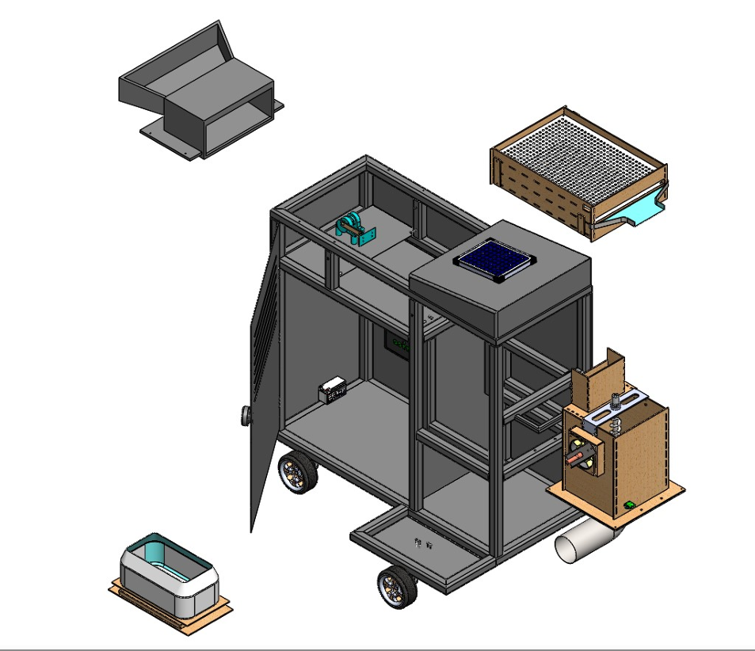
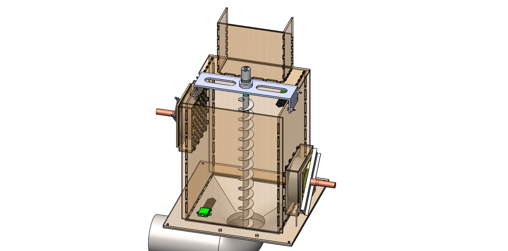
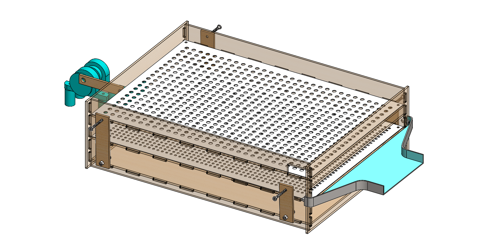
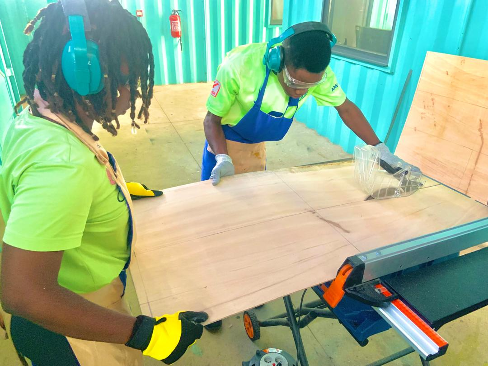
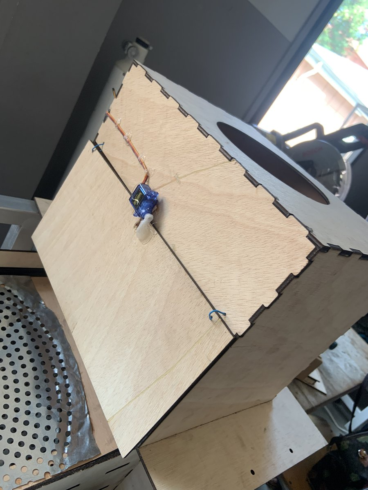
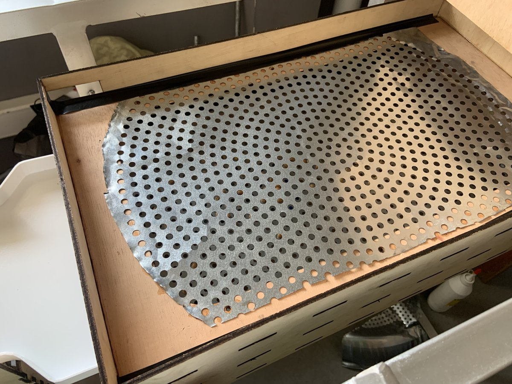
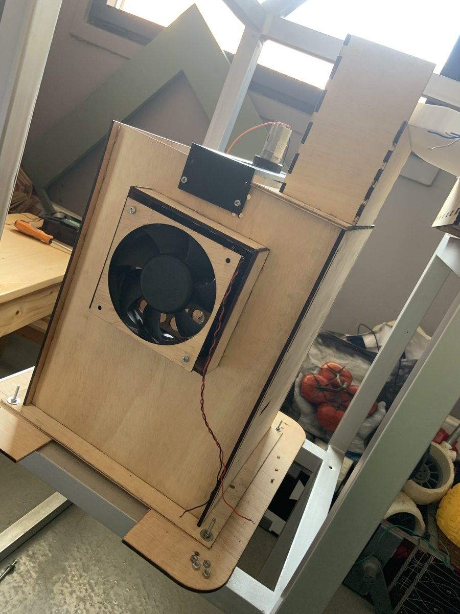

# Mechanical Design

Fichiers sources : [`mechanical/solidworks/Smart-Soja.STEP`](../mechanical/solidworks/Smart-Soja.STEP) (modèle 3D final de l'assemblage), [`mechanical/stl/`](../mechanical/stl/) (impression 3D), [`mechanical/drawings/`](../mechanical/drawings/) (découpe laser, mises en plan). Document de conception détaillé : [`mechanical/conception.md`](../mechanical/conception.md).

> Le dépôt étant public, seul le rendu final assemblé (format STEP, neutre) est publié — les fichiers SolidWorks natifs de chaque pièce/sous-assemblage (`.SLDPRT`/`.SLDASM`) ne sont pas partagés.

## Architecture modulaire

La conception mécanique repose sur un **châssis porteur** (acier, tubes 30–40 mm) accueillant **quatre blocs fonctionnels amovibles**, montés sur glissières et connecteurs rapides afin de permettre une maintenance en milieu rural isolé sans démontage intégral (retrait/repose d'un bloc en moins de 15 min).

| Bloc | Fonction |
|---|---|
| **Bloc 1 — Entrée** | Trémie pyramidale à écoulement gravitaire, vanne pilotée par servomoteur SG90, capteur IR1 de présence de soja |
| **Bloc 2 — Nettoyage / tamisage** | Deux tamis inox superposés sur suspensions élastiques, moteur JGA25-370 entraînant les oscillations via poulie/tige de transmission |
| **Bloc 3 — Séchage / analyse** | Vis sans fin (brassage), ensemble ventilateur + résistance chauffante, boîtiers pour sondes capacitives Soil1/Soil2 et DHT22 |
| **Bloc 4 — Pesée / réception** | Support cellule de charge (HX711), plateau de réception finale, capteur IR2 de retrait du sac |

## Matériaux

| Élément | Masse (kg) | Contrainte | Justification |
|---|---|---|---|
| Châssis porteur | 12,0 | Compression / haute | Acier (tubes 40 mm) : robustesse et soudabilité |
| Support tamis | 0,293 | Vibration / haute | Inox 304 : résistance à la corrosion et hygiène |
| Support capteur | 0,1 | Flexion / moyenne | PLA (impression 3D) : précision et légèreté |
| Roulettes (×4) | 2,0 | Chocs / élastique | Caoutchouc HD : absorption des vibrations |

## Outils de conception

- **SolidWorks** — modélisation 3D intégrale, simulation d'assemblage, mises en plan techniques.
- **KiCad** — conception du PCB embarqué (voir [03-hardware-design.md](03-hardware-design.md)).

## Fabrication et assemblage

Le châssis a été réalisé par découpe de panneaux de contreplaqué haute densité, aux dimensions issues de la modélisation SolidWorks, à l'atelier de **Sèmè City Open Park** (scie circulaire sur table).

Le prototype physique assemblé (juin 2026) est visible ci-dessous — blocs d'alimentation, de tamisage et de séchage :

## Voir aussi

- [`mechanical/drawings/`](../mechanical/drawings/) — DXF pour découpe laser, mise en plan (`Mise_en_plan_Smart-Soja.SLDDRW`)
- [`mechanical/stl/`](../mechanical/stl/) — pièces imprimables en 3D
- [07-testing-validation.md](07-testing-validation.md) — validation du tamisage et du séchage
