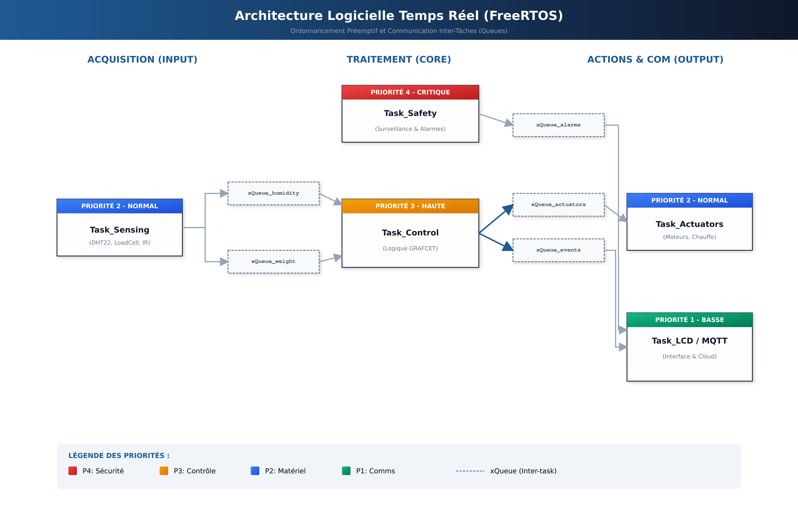
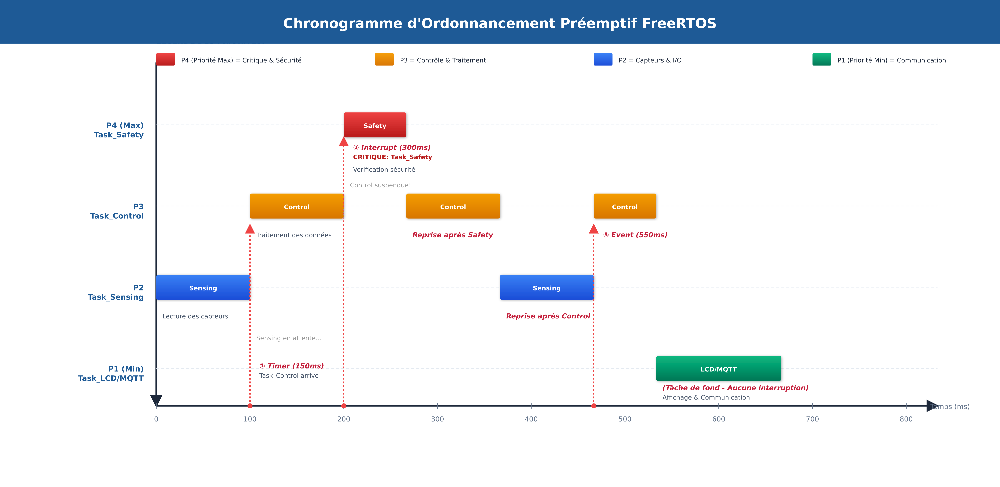
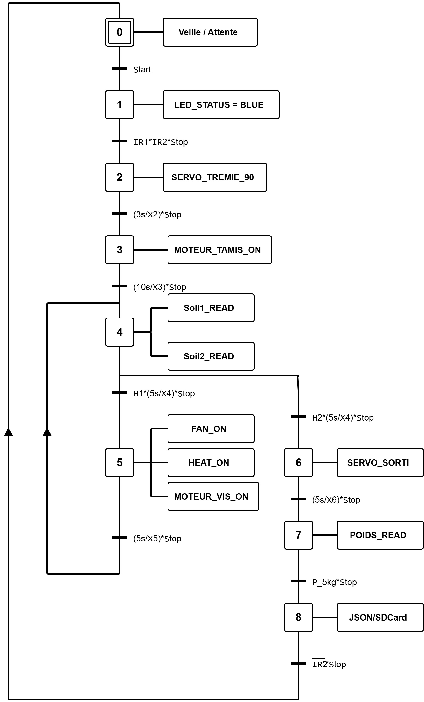
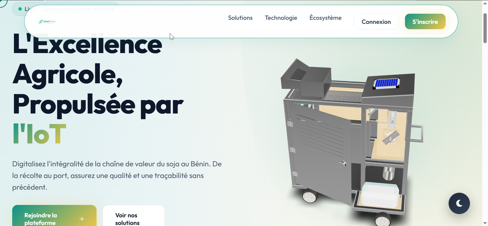
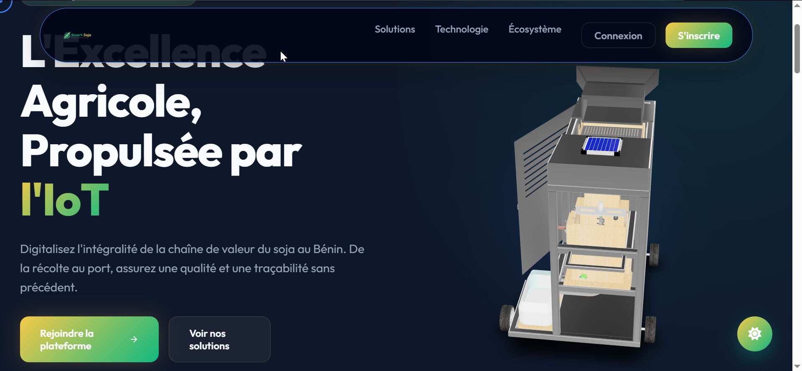
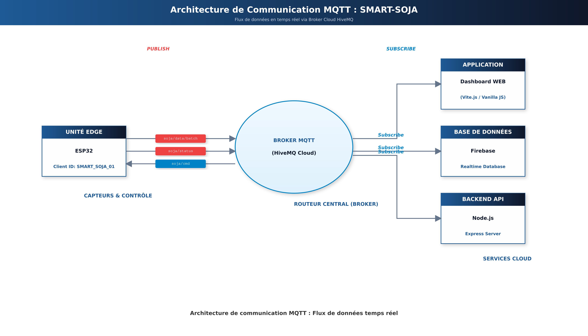

# Software Architecture

Firmware source : [`firmware/esp32/src/Code_Esp32_Smart-Soja.ino`](../firmware/esp32/src/Code_Esp32_Smart-Soja.ino). Plateforme web : [`cloud/dashboard/app/`](../cloud/dashboard/app/). API/passerelle MQTT : [`cloud/api/`](../cloud/api/).

## Firmware embarqué : FreeRTOS sur ESP32

Le firmware implémente **6 tâches FreeRTOS**, communiquant via 5 files de messages (queues) pour un découplage sans conditions de course. Les tâches de sécurité préemptent systématiquement toutes les autres.

| Tâche | Priorité | Cycle | Fonction |
|---|---|---|---|
| `Task_Safety` | 4 (max) | 10 ms | Arrêt d'urgence, surchauffe, timeout — réponse < 10 ms |
| `Task_Control` | 3 (haute) | 50 ms | Automate GRAFCET, transitions d'états |
| `Task_Sensing` | 2 (moy.) | 100 ms | Acquisition DHT22, Soil1/2, HX711 avec filtrage passe-bas |
| `Task_Actuators` | 2 (moy.) | 50 ms | Pilotage PWM moteurs, servo, LEDs |
| `Task_LCD` | 1 (faible) | 200 ms | Affichage I2C + lecture potentiomètres |
| `Task_MQTT` | 1 (faible) | 500 ms | Transmission JSON, Store-and-Forward sur SD si déconnecté |




Trois principes gouvernent l'ordonnancement : **préemption** (une tâche prioritaire suspend immédiatement la tâche courante), **reprise automatique** (le contexte suspendu est restauré tel quel) et **gestion des priorités** (les tâches faibles ne s'exécutent que si aucune tâche prioritaire n'est prête).

## Automatisme séquentiel : GRAFCET

Le cycle de traitement est modélisé en **GRAFCET à deux niveaux** :

- **Niveau 1 (fonctionnel)** — préparation (vérification trémie + sac) → traitement (nettoyage puis analyse d'humidité, séchage itératif si nécessaire) → clôture (pesée, enregistrement, attente de retrait du sac).
- **Niveau 2 (technologique)** — traduction en E/S ESP32 : capteurs IR1/IR2 et sondes capacitives en entrée ; servomoteurs (PWM) et MOSFETs de puissance en sortie.



**Logique de cycle :**
- **Saut de séquence** : si le soja est déjà sec à l'analyse initiale, l'étape de séchage est court-circuitée (économie d'énergie).
- **Reprise de séquence** : rebouclage systématique vers l'analyse après chaque phase de séchage.
- **Double validation de l'humidité** : l'ensachage n'est autorisé que si Soil1 **ET** Soil2 confirment individuellement H ≤ 12 %.
- **Sûreté de fonctionnement** : une évolution parallèle surveille en permanence le bouton d'arrêt d'urgence, capable d'interrompre le cycle à tout instant.

## Traçabilité numérique : MQTT + JSON

Deux types de trames sont publiés (voir [`cloud/mqtt/ESP32_PROTOCOL.md`](../cloud/mqtt/ESP32_PROTOCOL.md) pour la spécification complète) :

**Télémétrie périodique** (toutes les 5 s, topic `smart-soja/telemetry/{unitId}`) :
```json
{
  "unitId": "SS-000110",
  "timestamp": 1716633600000,
  "humidity": 12.5,
  "temperature": 31.8,
  "weight": 42.3,
  "ir1": true,
  "ir2": false,
  "mode": "auto",
  "step": 3,
  "alarm": false,
  "controls": {
    "alimentation": false,
    "tamis": true,
    "ventilateur": false,
    "chauffage": true,
    "vis_soja": true,
    "servo_vanne": false
  },
  "battery": 95
}
```

**Passeport numérique de fin de lot** (topic `smart-soja/lot_completed/{unitId}`) :
```json
{
  "unitId": "SS-000110",
  "timestamp": 1716633780000,
  "lotId": "LOT-TEST-002",
  "duration_ms": 180000,
  "weight_processed": 5000,
  "humidity_avg": 10.8,
  "temperature_avg": 31.8,
  "steps_completed": 12,
  "quality_score": 95
}
```

En cas de perte de connexion, ces trames sont archivées sur la carte MicroSD (format JSON) et renvoyées automatiquement dès le rétablissement du signal.

## Plateforme web (`cloud/dashboard/app/`)

Single Page Application développée en **Vite.js + JavaScript (Vanilla JS)**, synchronisée en temps réel avec Firebase.




**Pipeline de données :**
1. L'ESP32 publie les trames JSON via MQTT.
2. Le serveur `cloud/api/` (Node.js) intercepte, valide et persiste les messages dans Firebase.
3. Le dashboard se synchronise automatiquement avec Firebase (pas de rafraîchissement manuel).



**Trois profils :** Exploitant (suivi + contrôle manuel), Industrie GDIZ Ready (validation qualité + certificats PDF), Admin (flotte + utilisateurs).

## Outils de développement

- **Arduino IDE** — firmware ESP32.
- **VS Code** — dashboard web (HTML/JS), gestion Git.

## Voir aussi

- [02-system-architecture.md](02-system-architecture.md)
- [07-testing-validation.md](07-testing-validation.md) — validation de la transmission MQTT
