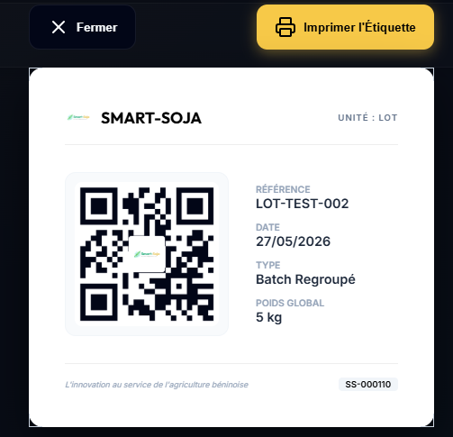
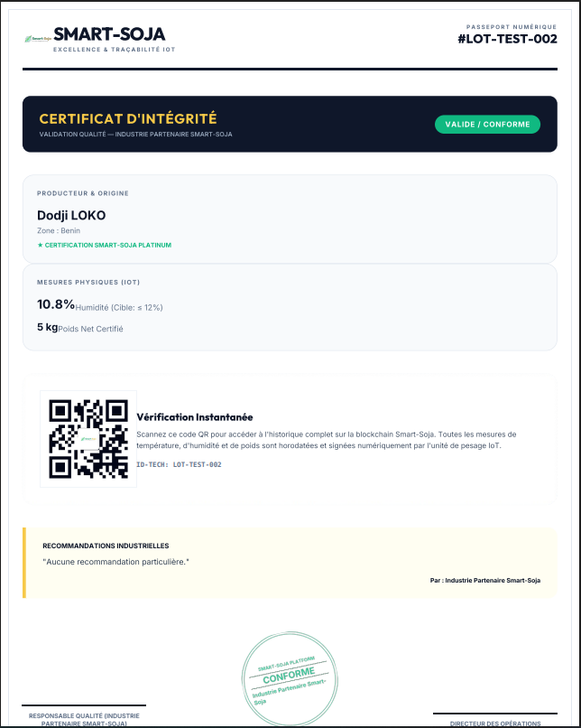
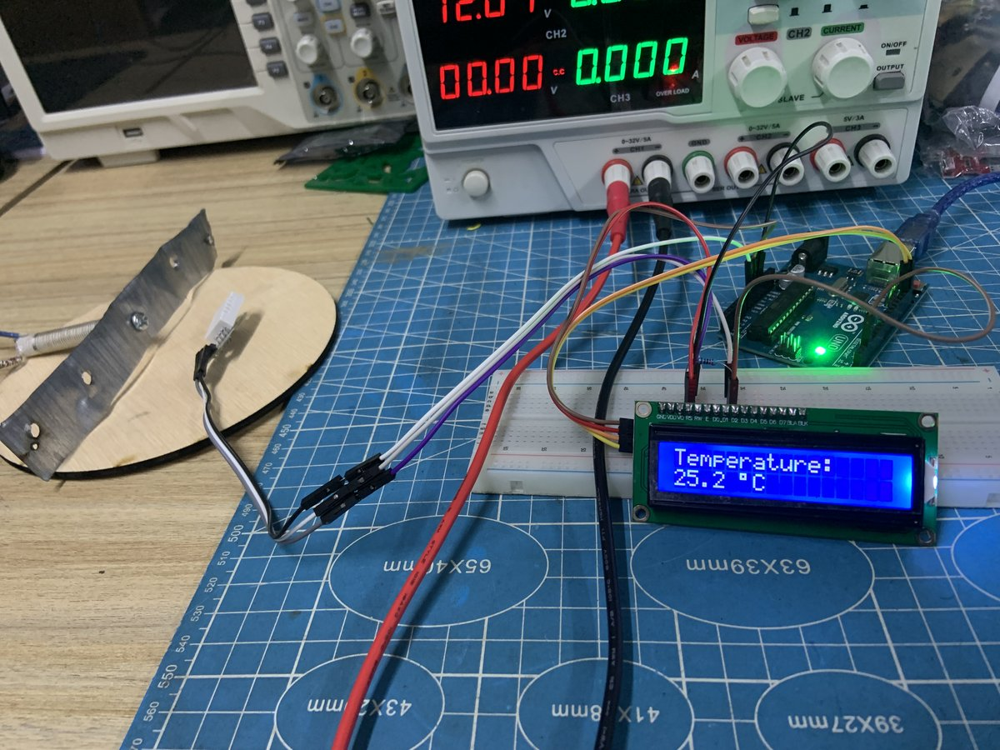

# Testing & Validation

État à juin 2026 : phase d'assemblage et d'intégration. L'approche retenue démontre la faisabilité technique et la conformité des sous-systèmes **individuels** par des tests unitaires rigoureux, avant validation en cycle complet et en charge réelle (voir [09-future-improvements.md](09-future-improvements.md)).

## Méthodologie

Chaque sous-système suit un protocole en 4 étapes :
1. **Test unitaire** — activation isolée du composant, vérification du comportement attendu.
2. **Test d'intégration partielle** — assemblage provisoire avec composants dépendants (ex. DHT22 + LCD).
3. **Démonstration de la chaîne numérique** — acquisition → affichage → transmission → stockage local.
4. **Documentation des observations** — relevé systématique du comportement et des anomalies.

| Sous-système | Fonction testée | Instrument | Critère de validation |
|---|---|---|---|
| Moteur du tamis | Entraînement et vibration | Observation + multimètre | Rotation continue, absence de bruit anormal |
| Capteur DHT22 | Mesure T°C et humidité | Afficheur LCD | Valeurs en plage réaliste |
| Capteurs d'humidité | Mesure humidité soja | LCD + multimètre (ADC) | Signal cohérent avec l'état du soja |
| Résistance chauffante | Montée en température | DHT22 + multimètre | Chauffe observable, consommation mesurable |
| Ventilateur | Circulation d'air | Observation visuelle | Rotation et flux d'air présents |
| Interface LCD + WiFi | Affichage et transmission | Consultation + broker MQTT | Affichage clair, réception MQTT |

## Validation des capteurs

**DHT22** — relevés stables sur une session de 30 min (24,5→24,8 °C, 58,0→58,3 % HR, variation ≤ 0,3 sur les deux grandeurs). Conclusion : capteur opérationnel pour la supervision temps réel.

**Sondes capacitives Soil1/Soil2** — testées par immersion progressive dans du soja de test :

| État du soja | Soil1 (ADC) | Soil2 (ADC) |
|---|---|---|
| Très sec (stockage) | 280–300 | 285–305 |
| Humide (après exposition) | 450–480 | 460–490 |
| Saturé (test extrême) | 650–680 | 660–690 |

Variation linéaire en plage utile, écart inter-sonde < 10 points ADC (bonne reproductibilité). Capteurs opérationnels pour piloter le cycle de séchage.

## Validation du tamisage

Rotation moteur continue et stable, oscillation du cadre régulière, consommation 0,8–1,0 A / 12 V (≈ 10 W, conforme au nominal), pas de ralentissement ni de surcharge. Débris visiblement séparés après 2 à 3 cycles — le mécanisme fonctionne, un ou plusieurs cycles supplémentaires peuvent être nécessaires sur soja très humide ou encrassé pour un taux de pureté optimal.

## Validation du séchage

| Composant | Mesure | Conclusion |
|---|---|---|
| Résistance chauffante | Chauffe visible dès 10 s, très chaude à 30 s ; 1,0–1,2 A / 12 V (≈ 14 W) | Fonctionnel, conforme |
| Ventilateur | Rotation stable, flux d'air observable ; 0,6–0,8 A / 12 V (≈ 8 W) | Circulation d'air effective |
| Moteur de brassage | Rotation sans blocage, agitation observée | Homogénéisation possible |

Chauffe + ventilation produisent effectivement une circulation d'air chaud — le concept de séchage est validé. Limite : pas encore de mesure précise de la durée de séchage nécessaire pour atteindre la cible d'humidité.

## Validation du système énergétique

Tensions et courants mesurés au multimètre par sous-système :

| Mode / Charge | Courant (A) | Observation |
|---|---|---|
| Veille (LCD) | 0,12–0,15 | Consommation très faible |
| Acquisition DHT22 | 0,03–0,05 | Négligeable |
| Moteur du tamis | 0,8–1,0 | Stable, pas de surcharge |
| Résistance chauffante | 1,0–1,2 | Nominale, stable |
| Ventilateur | 0,6–0,8 | Sans problème |
| **Pic maximum (tous systèmes)** | **1,5** | Batterie maintient tension > 12 V |

Aucun effondrement de tension observé pendant les cycles de test. Le système est correctement dimensionné pour plusieurs heures d'utilisation normale (voir [06-energy-system.md](06-energy-system.md)).

## Validation de la traçabilité IoT

| Critère | Résultat |
|---|---|
| Format et structure JSON | Conforme aux spécifications |
| Publication MQTT | Aucune perte observée pendant les essais documentés en laboratoire |
| Latence de transmission | 200–300 ms (labo) |
| Intégrité des données | Aucun payload invalide observé pendant les essais documentés |
| Sauvegarde locale (SD) | Mécanisme Store-and-Forward validé sur banc de test |
| Génération QR Code | 5/5 générés avec succès |

Le système génère un tableau de bord de supervision, une interface de configuration, une étiquette de lot avec QR Code et un certificat/passeport numérique. Cette chaîne documentaire a été validée sur le banc de test utilisé pendant le projet.

## Banc d'intégration

## Synthèse

| Fonction | Statut |
|---|---|
| Moteur tamis | ✅ Opérationnel |
| Capteur DHT22 | ✅ Opérationnel |
| Sondes d'humidité | ✅ Opérationnel |
| Résistance chauffante | ✅ Opérationnel |
| Ventilateur | ✅ Opérationnel |
| Interface LCD | ✅ Opérationnel |
| Transmission MQTT | ✅ Opérationnel |
| Module de pesée (HX711) | ⏳ Intégration finale en cours |
| Cycle complet nettoyage + séchage en charge réelle | ⏳ À valider (2–5 kg) |

Les principaux sous-systèmes ont été validés individuellement et en intégration partielle. La chaîne numérique acquisition → traitement → affichage → transmission a fonctionné sur le banc de test ; cela ne constitue pas encore une validation du cycle mécanique complet sous charge réelle. Détail des limites et recommandations : [09-future-improvements.md](09-future-improvements.md).
