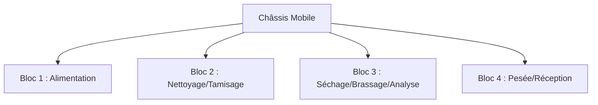

# Documentation Technique : Conception Mécanique SMART-SOJA

Ce document détaille la conception mécanique du système **SMART-SOJA**, réalisée sous logiciel de CAO professionnel (**SolidWorks**). L'architecture est basée sur une approche modulaire permettant une maintenance aisée et une fabrication par sous-ensembles.

---

## 1. Architecture Modulaire Globale

Le système est structuré en un châssis porteur accueillant quatre blocs fonctionnels amovibles. Cette conception garantit la polyvalence du système et facilite le transport en milieu agricole.

---

## 2. Unité Structurelle : Le Châssis

Le châssis constitue le squelette du système. Il a été conçu pour allier robustesse et mobilité.

* **Composants Clés** :
  * **Structure principale** : Châssis mécano-soudé ou profilé.
  * **Mobilité** : Système de 4 roues avec axes renforcés pour les terrains irréguliers.
  * **Accessibilité** : Utilisation de charnières et d'une porte pour l'accès technique à la partie électronique.

---

## 3. Analyse des Blocs Fonctionnels

### 3.1 Bloc 1 : Unité d'Entrée (Alimentation)

Situé en haut de la machine, ce bloc gère l'arrivée du soja brut.

* **Organe principal** : Trémie d'entrée.
* **Fonctionnement** : Écoulement gravitaire assisté par un servomoteur.

### 3.2 Bloc 2 : Unité de Nettoyage et Vibration

Ce bloc assure le retrait des impuretés (cailloux, poussières).

* **Tamisage** : Système de deux tamis superposés  avec des mailles de différentes tailles.
* **Vibration** : Utilisation d'un moteur à courant continu **JGA25-370** monté sur un support dédié.
* **Transmission** : Système de poulie et tige de transmission pour transformer le mouvement de rotation en oscillation vibratoire du tamis.

### 3.3 Bloc 3 : Unité de Séchage et Analyse (Cœur du Système)

C'est le bloc le plus complexe, assurant la régulation de l'humidité.

* **Brassage** : Une **vis sans fin** de type Archimède  assure le mouvement et le brassae constant du soja pour un séchage homogène.
* **Séchage** : Intégration d'un ensemble **Ventilateur + Résistance Chauffante (RC)**.
* **Analyse IoT** : Boîtiers spécifiques pour les capteurs d'humidité capacitifs, températures et support pour capteur infrarouge.

### 3.4 Bloc 4 : Unité de Pesée et Réception

Dernière étape du processus avant la mise en sac.

* **Mesure** : Support pour cellule de charge (**Load Cell**) permettant une pesée en temps réel du soja traité.
* **Réception** : Plateau support et bocal de réception finale.

---

## 4. Spécifications de Fabrication

* **Logiciel de CAO** : SolidWorks.
* **Matériaux envisagés** :
  * Acier galvanisé ou aluminium pour le châssis.
  * Plastique alimentaire (type PETG/PLA) pour quelques pièces d'assemblages et boîtiers capteurs (impression 3D).
  * Contre plaquet pour les parois de la zone de séchage.
* **Maintenance** : Chaque bloc peut être retiré du châssis sans démonter l'intégralité du système.
